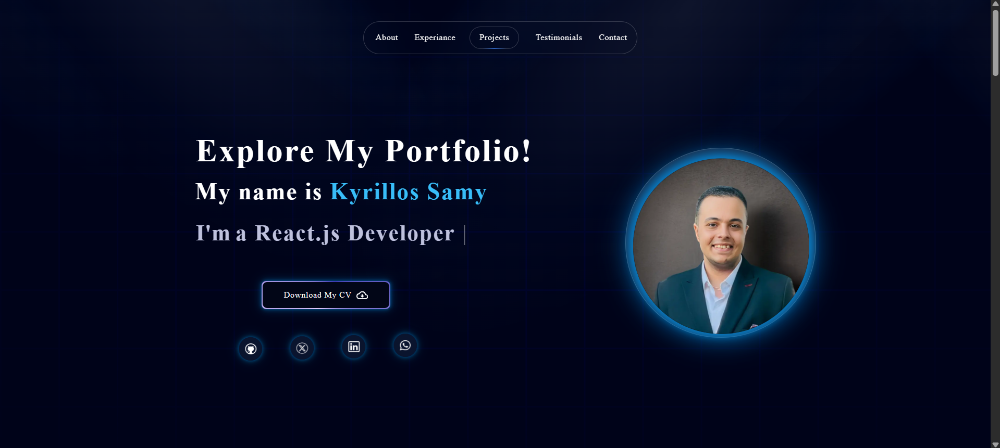
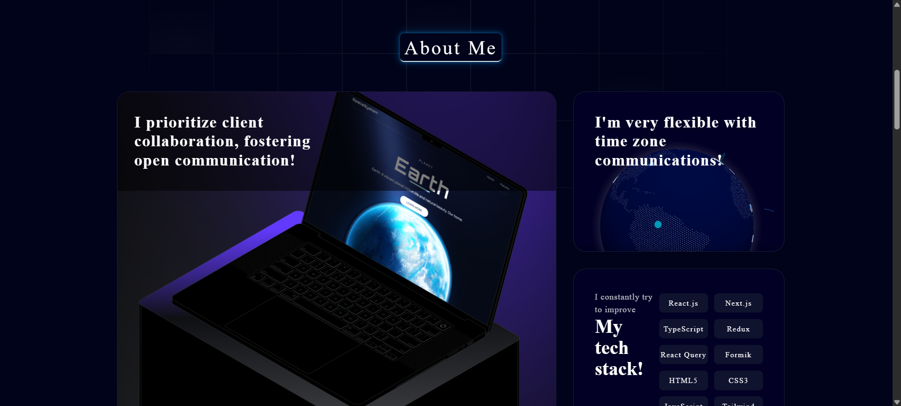
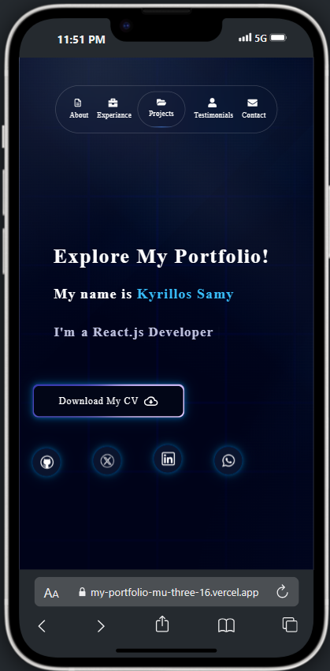
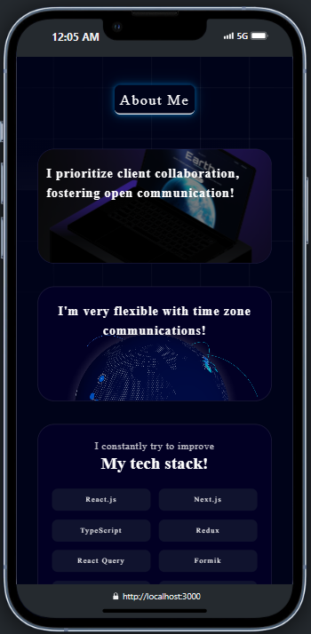

# 🌐 Kyrillos Samy's Portfolio

**Kyrillos Samy Doksh Hanna's Portfolio** is a sleek and interactive developer portfolio showcasing cutting-edge work, technical skills, and creativity in full-stack development using modern tools like Next.js, Tailwind CSS, and Framer Motion. Whether you're an employer, collaborator, or fellow dev, this site is designed to leave a lasting impression.

---

## 🚀 Live Preview

[](https://my-portfolio-mu-three-16.vercel.app/)  

---

## 🎯 Features

- 🧠 **About Me Section**: Quick snapshot of who I am and what I bring to the table  
- 🛠️ **Tech Stack Highlights**: Featuring Next.js, React.js, TypeScript, Redux, Tailwind CSS, Framer Motion, and more  
- 📁 **Projects Showcase**: Scrollable grid of deployed projects with live previews and repo links  
- 💬 **Contact Section**: Lets people reach out directly via email or LinkedIn  
- 🎨 **Smooth Animations**: Built with **Framer Motion** and styled using **Tailwind CSS**  
- ⚡ **Fully Responsive**: Looks great on mobile, tablet, and desktop  
- ✨ **UI/UX Design from `Aceternity UI`**: Sleek modern components with motion magic

---

## 🧠 Tech Stack

| Layer        | Tech Used                     |
|--------------|-------------------------------|
| Frontend     | Next.js 15 (App Router)       |
| Styling      | Tailwind CSS, Aceternity UI   |
| Animation    | Framer Motion                 |
| Deployment   | Vercel                        |
| Fonts/Icons  | Google Fonts, Lucide Icons    |
| Hosting      | GitHub, Vercel                |

---

## 🏗️ Project Structure

```
📦 My-Portfolio
├── public                     
│   └── images/, favicon, etc.
├── app/                        # Next.js App Router pages & routes
│   ├── layout.tsx             # Shared layout component
│   └── page.tsx               # Homepage content
├── components/                # Reusable components (Navbar, Footer, Projects, etc.)
├── styles/                    # Tailwind config & globals
├── README.md
├── LICENSE
├── .gitignore
├── tailwind.config.ts
├── package.json
└── next.config.mjs
```

---

## 📌 Sections Overview

### 🎯 Hero

- Name, title, short description  
- CTA buttons (Contact, Projects, Resume)  

### 👨‍💼 About Me

- Short bio, mission, education, and personal drive  
- Built with responsive layout and scroll animations  

### 💼 Projects

- Interactive cards with links & hover effects  
- Uses `Framer Motion` for smooth animation  
- Includes GitHub & live preview links  

### 🧠 Experience

- Timeline-style layout using cards  
- Details include job title, description, duration  

### 🗣️ Testimonials

- Sliding quotes from real people  
- Styled using `ui.aceternity` testimonial component  

### 📬 Contact

- Email Link / direct contact info  
- Clean design with validation and clarity  

---

## 📸 Previews

Here’s a sneak peek of **My Portfolio** in action:

### 🖼️ Desktop View




### 📱 Mobile View




> 🎥 Want more? Hover animations, color variants, and dynamic cards previews come alive in the full app!

---

## ⚙️ Getting Started

1. Clone the repo:

```bash
git clone https://github.com/Kyrillos-Samy1/my-portfolio.git
```

2. Navigate into the project:

```bash
cd Portfolio
```

3. Install dependencies:

```bash
npm install
```

4. Run the development server:

```bash
npm run dev
```

---

## 🔐 Legal Notice & Usage Policy

This project is created for **personal branding and educational use only**.  
All code, assets, and content are owned by **Kyrillos Samy Doksh Hanna**.

🚫 **Unauthorized use, reproduction, or distribution of this code for commercial purposes is strictly prohibited**.

📄 Licensed under the [MIT License](./LICENSE).

> For commercial inquiries, collaborations, or special permissions, please get in touch with me directly at: `kyrillossamy@outlook.com`
---

## 💬 Contact

Crafted with vision and style by **Kyrillos Samy Doksh Hanna**  
📧 Email: `kyrillossamy@outlook.com`  
📱 Phone: `+20-1271470997`  
🎖️ Nickname: `Empire Coder`  
🌍 Based in Egypt

---

> **Still learning, still building, always improving.**